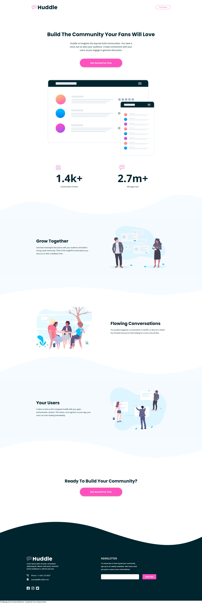

# Huddle landing page with curved sections solution

This is a solution to the [Huddle landing page with curved sections challenge on Frontend Mentor](https://www.frontendmentor.io/challenges/huddle-landing-page-with-curved-sections-5ca5ecd01e82137ec91a50f2). Frontend Mentor challenges help you improve your coding skills by building realistic projects.

This project contains to versions of this implementation. The 'next' directory contains a next.js application built with styled-components and the 'next-css-modules' directory conatins as you might have guessed a next.js application using CSS Modules.

## Table of contents

- [Overview](#overview)
  - [The challenge](#the-challenge)
  - [Screenshot](#screenshot)
  - [Links](#links)
- [My process](#my-process)
  - [Built with](#built-with)
  - [What I learned](#what-i-learned)
  - [Continued development](#continued-development)
  - [Useful resources](#useful-resources)
- [Author](#author)

## Overview

### The challenge

Users should be able to:

- View the optimal layout for the site depending on their device's screen size
- See hover states for all interactive elements on the page
  BONUS self-added challenges
- Make layout responsive for screen sizes between 375px and 1440px

### Screenshot



### Links

- Solution URL: [Github Solution](https://github.com/jwdesjardin/huddle-landing-page-curved-sections)
- Live Site URL: [Huddle Landing Page with Curved Sections - Live Demo](https://huddle-landing-page-curved-sections-cssmodules.vercel.app/)

## My process

### Built with

- Semantic HTML5 markup
- CSS custom properties
- SCSS
- CSS Grid
- Mobile-first workflow
- [React](https://reactjs.org/) - JS library
- [Next.js](https://nextjs.org/) - React framework
- [Styled Components](https://styled-components.com/) - For styles

### What I learned

##### SVG backgounds

I choose this project becuase i wasnt exactly sure how i would do a background like is in this design. After opening the design files and finding hte curvy sections inclued as SVG files i did some research to find good methods of doing this. I fould some techniques [this one](https://css-tricks.com/creating-non-rectangular-headers/) one from CSS Tricks. The main key i used was if you are using a div then your are going to back to specifiy in your CSS to display:block. You want to use a height based on the viewport width to get the scg to stay at a consistent wave shape.

##### SCSS Media Queries

I used component level media queries for each component. This kept all the code for a component in one place.

```scss
.logo {
	width: 96px;
	height: 16px;
	@media (min-width: 768px) {
		width: 120px;
		height: 19px;
	}
	@media (min-width: 1440px) {
		width: 240px;
		height: 38px;
	}
}
```

##### Reusable Hero Component

Hero Component:

```js
export const Hero = ({ heading, text, button, imgURL, altText, secondary }) => {
	return (
		<div className={styles.container + ' contained'}>
			{/* OPTIONAL HEADER */}
			{heading && (
				<h1 className={secondary ? styles.secondaryTitle : styles.primaryTitle}>{heading}</h1>
			)}
			{/* OPTIONAL TEXT */}
			{text && <p className={styles.text}>{text}</p>}
			{/* OPTIONAL BUTTON */}
			{button && <button className={styles.button}>Get Started For Free</button>}
			{/* OPTIONAL IMAGE */}
			{imgURL && (
				<div style={{ margin: '6rem 0 1rem' }}>
					<Image src={imgURL} alt={altText ? altText : ''} width='1016px' height='720px' />
				</div>
			)}
		</div>
	)
}
```

First Use:

```js
<Hero
	heading={`Build The Community Your Fans Will Love`}
	text={`Huddle re-imagines the way we build communities. You have a voice, but so does
  your audience. Create connections with your users as you engage in genuine discussion.`}
	button={true}
	imgURL={`/images/screen-mockups.svg`}
	altText={`illustration of mockups`}
></Hero>
```

Second Use:

```js
<Hero heading={`Ready To Build Your Community?`} button={true} secondary={true}></Hero>
```

### Continued development

##### CLS Score (Next.js Image Componet)

I want to continue to use the Next.js Image component as well as track my site performance analytics on the pages that i am developing.

In the vercel analytics page I was unable to get my CLS (Cumulative Layout Shift) score to an optimal score. I know that using the Image component from Next.js and giving it a starting height for your images should be a major way to improve the layout shift. However i was having trouble finding a way in this project to avoid layout shift with the svg backgrounds. I am using different images at different breakpoints one way i tried was using a div and changing out the backgorund image based on media queries. With this method i was still getting a warning for my CLS score.

##### CSS frameworks

**SCSS**
Continue to learn more about SCSS to leverage this over vanilla CSS in all projects. Using @include, @apply, and mixins can be helpful. Read more Docs for this.

**CSS Modules**
I like using this as the default inside next.js apps as it is included in the framework.

**Tailwind CSS**
Possibly pick this up in my next project to increase speeds for protyping / building

**Chakra UI**
My experience with this has been great for react projects using theming.

**Styled Components**
This syntax of this is awesome the scoping of styles to components is great as well. The fact the JS is compiling the CSS is unique about this and the lack of symantic class names is also a down point.

### Useful resources

- [Best Way to Embed an SVG](https://vecta.io/blog/best-way-to-embed-svg)
- [CSS Tricks: creating a non-rectangular header](https://css-tricks.com/creating-non-rectangular-headers/)
- [StackOverflow: get rid of extra space below SVG](https://stackoverflow.com/questions/24626908/how-to-get-rid-of-extra-space-below-svg-in-div-element)

## Author

- Website - [JoeyDesjardin.com](https://www.joeydesjardin.com)
- Frontend Mentor - [@yourusername](https://www.frontendmentor.io/profile/jwdesjardin)
